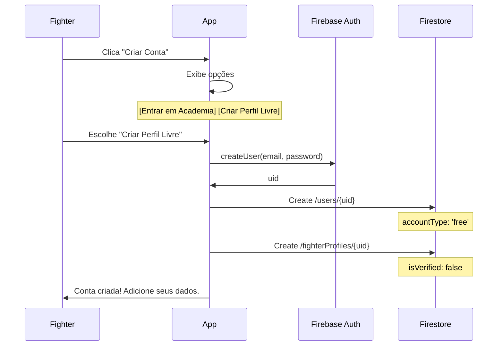
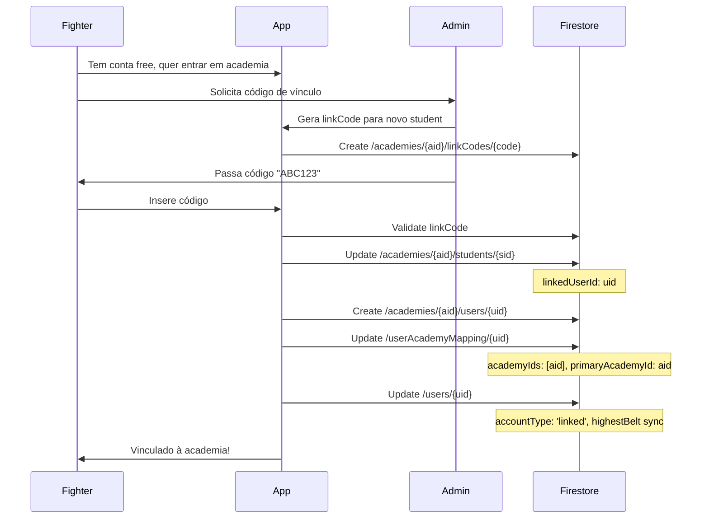
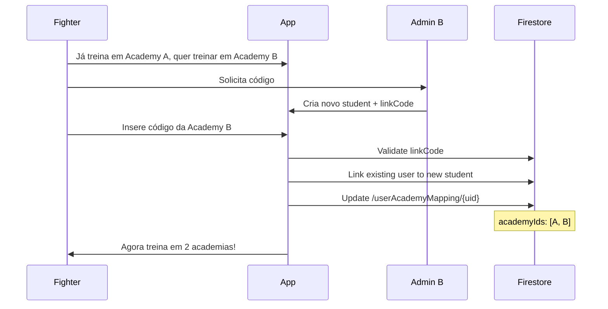
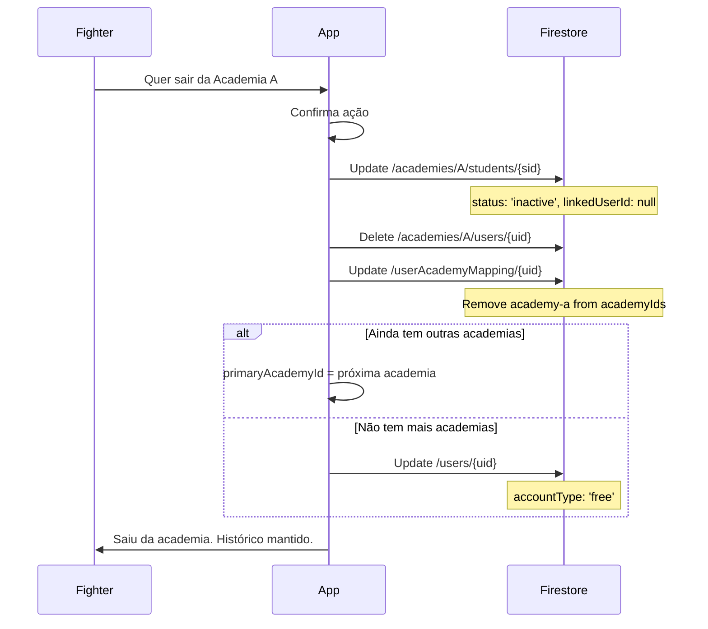
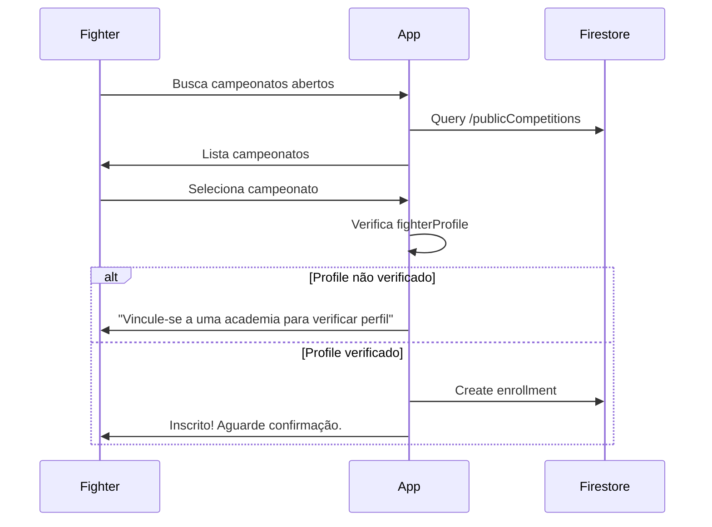

# Proposta de Arquitetura: Users Independentes de Academias

## Visão Geral

Este documento descreve a arquitetura proposta para permitir que lutadores:
1. Criem contas independentes de academias
2. Usem seus perfis para inscrição em campeonatos
3. Treinem em múltiplas academias
4. Saiam de uma academia e entrem em outra

---

## Estrutura de Dados Proposta

### Collections ROOT (Globais)

```typescript
// /users/{uid} - Identidade global do usuário
interface GlobalUser {
  id: string;                    // Firebase UID
  email: string;
  displayName: string;
  photoUrl?: string;
  phone?: string;

  // Dados pessoais do lutador (independente de academia)
  birthDate?: Date;
  cpf?: string;
  weight?: number;

  // Histórico global de jiu-jitsu
  jiujitsuStartDate?: Date;      // Quando começou a treinar
  highestBelt: BeltColor;        // Maior faixa obtida
  highestStripes: number;        // Graus na maior faixa

  // Status da conta
  accountType: 'free' | 'linked';  // free = sem academia, linked = em academia(s)
  isProfilePublic: boolean;        // Visível para outros

  // Timestamps
  createdAt: Date;
  updatedAt: Date;
}

// /userAcademyMapping/{uid} - Relação user ↔ academias
interface UserAcademyMapping {
  userId: string;
  academyIds: string[];          // Todas as academias que pertence
  primaryAcademyId?: string;     // Academia padrão (pode ser null se saiu de todas)

  // Detalhes por academia
  academyDetails: {
    [academyId: string]: {
      studentId: string;         // ID do student record nessa academia
      role: 'student' | 'instructor' | 'admin';
      joinedAt: Date;
      status: 'active' | 'inactive' | 'pending';
    }
  }
}

// /fighterProfiles/{uid} - Perfil público para campeonatos (opcional)
interface FighterProfile {
  userId: string;
  displayName: string;
  nickname?: string;
  photoUrl?: string;

  // Dados competitivos
  currentBelt: BeltColor;
  currentStripes: number;
  weight?: number;
  ageGroup?: 'master' | 'adult' | 'juvenile';

  // Histórico de campeonatos
  competitionHistory?: {
    competitionId: string;
    competitionName: string;
    date: Date;
    result?: 'gold' | 'silver' | 'bronze' | 'participated';
    category?: string;
  }[];

  // Academia atual (para mostrar filiação)
  currentAcademyId?: string;
  currentAcademyName?: string;

  // Verificação
  isVerified: boolean;           // Academia confirmou os dados
  verifiedBy?: string;           // academyId que verificou
  verifiedAt?: Date;

  updatedAt: Date;
}

// /publicCompetitions/{competitionId} - Campeonatos abertos (não de academia específica)
interface PublicCompetition {
  id: string;
  name: string;
  date: Date;
  location: string;
  federation?: string;

  // Inscrições abertas para qualquer lutador
  enrollmentOpen: boolean;
  enrollmentDeadline: Date;

  // Categorias disponíveis
  categories: CompetitionCategory[];

  // Organizador
  organizedBy?: string;          // academyId ou null se federação
}
```

### Collections por Academia (Scoped)

```typescript
// /academies/{academyId}/students/{studentId} - SEM MUDANÇAS
interface Student {
  id: string;
  fullName: string;

  // Dados do treino NESTA academia
  startDate: Date;               // Quando começou AQUI
  currentBelt: BeltColor;        // Faixa NESTA academia
  currentStripes: number;
  attendanceCount: number;       // Presenças AQUI

  // Link para user global
  linkedUserId?: string;         // Referência ao /users/{uid}

  // Status na academia
  status: 'active' | 'inactive' | 'injured' | 'suspended';

  // Financeiro específico da academia
  planId?: string;
  tuitionValue: number;
  tuitionDay: number;
}

// /academies/{academyId}/users/{uid} - Contexto do user na academia
interface AcademyUser {
  id: string;                    // Firebase UID
  email: string;
  displayName: string;
  role: 'admin' | 'instructor' | 'student' | 'guardian';

  // Links específicos desta academia
  studentId?: string;            // Student record NESTA academia
  linkedStudentIds?: string[];   // Filhos NESTA academia (para responsáveis)

  joinedAt: Date;
  status: 'active' | 'pending_approval' | 'inactive';
}
```

---

## Fluxos de Usuário

### Fluxo 1: Criar Conta Independente (Sem Academia)



**Dados criados:**
```typescript
// /users/{uid}
{
  email: "joao@email.com",
  displayName: "João Silva",
  accountType: 'free',
  isProfilePublic: false,
  createdAt: now()
}

// /fighterProfiles/{uid}
{
  userId: uid,
  displayName: "João Silva",
  isVerified: false,
  updatedAt: now()
}

// /userAcademyMapping/{uid}
{
  userId: uid,
  academyIds: [],
  primaryAcademyId: null,
  academyDetails: {}
}
```

### Fluxo 2: Lutador Livre Entra em Academia



**Dados atualizados:**
```typescript
// /userAcademyMapping/{uid}
{
  userId: uid,
  academyIds: ["academy-abc"],
  primaryAcademyId: "academy-abc",
  academyDetails: {
    "academy-abc": {
      studentId: "student-123",
      role: 'student',
      joinedAt: now(),
      status: 'active'
    }
  }
}

// /users/{uid}
{
  ...existingData,
  accountType: 'linked',
  highestBelt: "white",  // Sync com academia
  highestStripes: 0
}

// /fighterProfiles/{uid}
{
  ...existingData,
  currentBelt: "white",
  currentAcademyId: "academy-abc",
  currentAcademyName: "Academia XYZ",
  isVerified: true,
  verifiedBy: "academy-abc",
  verifiedAt: now()
}
```

### Fluxo 3: Lutador Entra em Segunda Academia



**Dados atualizados:**
```typescript
// /userAcademyMapping/{uid}
{
  userId: uid,
  academyIds: ["academy-a", "academy-b"],
  primaryAcademyId: "academy-a",  // Mantém a primária
  academyDetails: {
    "academy-a": {
      studentId: "student-a-123",
      role: 'student',
      joinedAt: "2024-01-01",
      status: 'active'
    },
    "academy-b": {
      studentId: "student-b-456",
      role: 'student',
      joinedAt: now(),
      status: 'active'
    }
  }
}
```

### Fluxo 4: Lutador Sai de uma Academia



### Fluxo 5: Inscrição em Campeonato Público



---

## Regras de Negócio

### Sincronização de Faixa

Quando um lutador está em múltiplas academias, a **maior faixa** é considerada:

```typescript
function syncHighestBelt(userId: string) {
  const mapping = await getDoc(userAcademyMapping(userId));
  let highestBelt = 'white';
  let highestStripes = 0;

  for (const academyId of mapping.academyIds) {
    const studentId = mapping.academyDetails[academyId].studentId;
    const student = await getDoc(students(academyId, studentId));

    if (compareBelts(student.currentBelt, highestBelt) > 0) {
      highestBelt = student.currentBelt;
      highestStripes = student.currentStripes;
    } else if (student.currentBelt === highestBelt && student.currentStripes > highestStripes) {
      highestStripes = student.currentStripes;
    }
  }

  await updateDoc(users(userId), { highestBelt, highestStripes });
  await updateDoc(fighterProfiles(userId), { currentBelt: highestBelt, currentStripes: highestStripes });
}
```

### Verificação de Perfil

Um perfil só é "verificado" se:
1. Está vinculado a pelo menos uma academia ativa
2. A academia confirmou os dados (faixa, categoria)

```typescript
async function verifyProfile(userId: string, academyId: string) {
  const mapping = await getDoc(userAcademyMapping(userId));

  if (!mapping.academyIds.includes(academyId)) {
    throw new Error('Usuário não pertence a esta academia');
  }

  const studentId = mapping.academyDetails[academyId].studentId;
  const student = await getDoc(students(academyId, studentId));

  await updateDoc(fighterProfiles(userId), {
    currentBelt: student.currentBelt,
    currentStripes: student.currentStripes,
    weight: student.weight,
    isVerified: true,
    verifiedBy: academyId,
    verifiedAt: serverTimestamp()
  });
}
```

### Permissões por Academia

Cada academia tem suas próprias permissões:

```typescript
// Firestore Rules
rules_version = '2';
service cloud.firestore {
  match /databases/{database}/documents {

    // Users globais - qualquer um autenticado pode criar/ler o próprio
    match /users/{userId} {
      allow read, write: if request.auth.uid == userId;
    }

    // Fighter profiles - público para leitura se isProfilePublic
    match /fighterProfiles/{userId} {
      allow read: if resource.data.isProfilePublic == true
                  || request.auth.uid == userId;
      allow write: if request.auth.uid == userId;
    }

    // User-Academy Mapping - próprio user ou admin da academia
    match /userAcademyMapping/{userId} {
      allow read: if request.auth.uid == userId;
      allow write: if request.auth.uid == userId
                   || isAcademyAdmin(request.auth.uid, resource.data.primaryAcademyId);
    }

    // Academy-scoped data - apenas membros
    match /academies/{academyId}/{document=**} {
      allow read, write: if isAcademyMember(request.auth.uid, academyId);
    }

    function isAcademyMember(uid, academyId) {
      return exists(/databases/$(database)/documents/academies/$(academyId)/users/$(uid));
    }

    function isAcademyAdmin(uid, academyId) {
      let user = get(/databases/$(database)/documents/academies/$(academyId)/users/$(uid));
      return user.data.role == 'admin';
    }
  }
}
```

---

## Migração de Dados

### Fase 1: Criar estruturas novas (sem quebrar existente)

```typescript
// Script de migração
async function migrateToNewArchitecture() {
  // 1. Criar fighterProfiles para users existentes
  const usersSnapshot = await getDocs(collection(db, 'users'));

  for (const userDoc of usersSnapshot.docs) {
    const user = userDoc.data();

    // Criar fighterProfile se não existe
    const profileRef = doc(db, 'fighterProfiles', userDoc.id);
    if (!(await getDoc(profileRef)).exists()) {
      await setDoc(profileRef, {
        userId: userDoc.id,
        displayName: user.displayName,
        currentBelt: user.highestBelt || 'white',
        currentStripes: user.highestStripes || 0,
        isVerified: user.accountType === 'linked',
        updatedAt: serverTimestamp()
      });
    }

    // Garantir userAcademyMapping existe
    const mappingRef = doc(db, 'userAcademyMapping', userDoc.id);
    if (!(await getDoc(mappingRef)).exists()) {
      // Buscar academias do user
      const academiesWithUser = await findAcademiesForUser(userDoc.id);

      await setDoc(mappingRef, {
        userId: userDoc.id,
        academyIds: academiesWithUser.map(a => a.academyId),
        primaryAcademyId: academiesWithUser[0]?.academyId || null,
        academyDetails: academiesWithUser.reduce((acc, a) => ({
          ...acc,
          [a.academyId]: {
            studentId: a.studentId,
            role: a.role,
            joinedAt: a.joinedAt || new Date(),
            status: 'active'
          }
        }), {})
      });
    }
  }
}
```

### Fase 2: Atualizar serviços para usar nova estrutura

```typescript
// Novo AuthService
class AuthService {
  async createFreeAccount(email: string, password: string, displayName: string) {
    // 1. Criar user no Firebase Auth
    const { user } = await createUserWithEmailAndPassword(auth, email, password);

    // 2. Criar documento global
    await setDoc(doc(db, 'users', user.uid), {
      email,
      displayName,
      accountType: 'free',
      isProfilePublic: false,
      createdAt: serverTimestamp(),
      updatedAt: serverTimestamp()
    });

    // 3. Criar fighterProfile vazio
    await setDoc(doc(db, 'fighterProfiles', user.uid), {
      userId: user.uid,
      displayName,
      isVerified: false,
      updatedAt: serverTimestamp()
    });

    // 4. Criar userAcademyMapping vazio
    await setDoc(doc(db, 'userAcademyMapping', user.uid), {
      userId: user.uid,
      academyIds: [],
      primaryAcademyId: null,
      academyDetails: {}
    });

    return user;
  }

  async linkToAcademy(userId: string, linkCode: string) {
    // 1. Validar código
    const codeData = await this.validateLinkCode(linkCode);

    // 2. Atualizar student com linkedUserId
    await updateDoc(
      doc(db, `academies/${codeData.academyId}/students/${codeData.studentId}`),
      { linkedUserId: userId }
    );

    // 3. Criar academyUser
    const userDoc = await getDoc(doc(db, 'users', userId));
    await setDoc(
      doc(db, `academies/${codeData.academyId}/users/${userId}`),
      {
        ...userDoc.data(),
        role: 'student',
        studentId: codeData.studentId,
        joinedAt: serverTimestamp(),
        status: 'active'
      }
    );

    // 4. Atualizar userAcademyMapping
    const mappingRef = doc(db, 'userAcademyMapping', userId);
    const mapping = (await getDoc(mappingRef)).data();

    await updateDoc(mappingRef, {
      academyIds: arrayUnion(codeData.academyId),
      primaryAcademyId: mapping?.primaryAcademyId || codeData.academyId,
      [`academyDetails.${codeData.academyId}`]: {
        studentId: codeData.studentId,
        role: 'student',
        joinedAt: serverTimestamp(),
        status: 'active'
      }
    });

    // 5. Atualizar user global
    await updateDoc(doc(db, 'users', userId), {
      accountType: 'linked',
      updatedAt: serverTimestamp()
    });

    // 6. Marcar código como usado
    await this.markLinkCodeAsUsed(linkCode, userId);

    // 7. Sync belt info
    await this.syncHighestBelt(userId);
  }

  async leaveAcademy(userId: string, academyId: string) {
    // 1. Buscar mapping atual
    const mappingRef = doc(db, 'userAcademyMapping', userId);
    const mapping = (await getDoc(mappingRef)).data();

    if (!mapping?.academyIds.includes(academyId)) {
      throw new Error('Usuário não pertence a esta academia');
    }

    const studentId = mapping.academyDetails[academyId].studentId;

    // 2. Desvincular student
    await updateDoc(
      doc(db, `academies/${academyId}/students/${studentId}`),
      {
        linkedUserId: null,
        status: 'inactive'
      }
    );

    // 3. Remover academyUser
    await deleteDoc(doc(db, `academies/${academyId}/users/${userId}`));

    // 4. Atualizar mapping
    const newAcademyIds = mapping.academyIds.filter(id => id !== academyId);
    const newDetails = { ...mapping.academyDetails };
    delete newDetails[academyId];

    await updateDoc(mappingRef, {
      academyIds: newAcademyIds,
      primaryAcademyId: newAcademyIds[0] || null,
      academyDetails: newDetails
    });

    // 5. Se não tem mais academias, voltar para free
    if (newAcademyIds.length === 0) {
      await updateDoc(doc(db, 'users', userId), {
        accountType: 'free',
        updatedAt: serverTimestamp()
      });

      await updateDoc(doc(db, 'fighterProfiles', userId), {
        isVerified: false,
        verifiedBy: deleteField(),
        verifiedAt: deleteField(),
        currentAcademyId: deleteField(),
        currentAcademyName: deleteField()
      });
    } else {
      // Re-sync belt com academias restantes
      await this.syncHighestBelt(userId);
    }
  }
}
```

---

## Impacto nos Apps

### Next.js (Webapp)

| Componente | Mudança |
|------------|---------|
| AuthProvider | Suportar criação de conta free |
| AcademyContext | Lidar com `primaryAcademyId: null` |
| Login Page | Adicionar fluxo "Criar Perfil Livre" |
| Profile Page | Mostrar dados de fighterProfile |
| Settings | Opção de "Sair da Academia" |
| Competitions | Permitir inscrição com perfil verificado |

### Flutter (App Mobile)

| Componente | Mudança |
|------------|---------|
| auth_provider | Suportar accountType: 'free' |
| Login/Register | Adicionar opção "Criar Perfil Livre" |
| Profile Screen | Mostrar fighterProfile + academias |
| Settings | Opção de "Sair da Academia" |
| Academy Switcher | UI para trocar academia ativa |

---

## Timeline de Implementação

### Sprint 1: Estrutura Base
- [ ] Criar collections `fighterProfiles` e atualizar `userAcademyMapping`
- [ ] Script de migração de dados existentes
- [ ] Atualizar Firestore rules

### Sprint 2: Fluxo de Conta Livre
- [ ] Tela de criação de conta com opção "Perfil Livre"
- [ ] AuthService.createFreeAccount()
- [ ] Tela de perfil do lutador

### Sprint 3: Multi-Academia
- [ ] UI de troca de academia (both apps)
- [ ] AuthService.leaveAcademy()
- [ ] Sync automático de faixa

### Sprint 4: Campeonatos Públicos
- [ ] Collection publicCompetitions
- [ ] Tela de busca de campeonatos
- [ ] Fluxo de inscrição com perfil verificado

---

## Considerações Finais

### Vantagens
1. **Identidade unificada** - Lutador tem um perfil global
2. **Flexibilidade** - Pode treinar onde quiser, mudar de academia
3. **Histórico preservado** - Dados não são perdidos ao sair de academia
4. **Campeonatos** - Pode se inscrever com perfil verificado

### Riscos
1. **Complexidade** - Mais pontos de sincronização
2. **Conflito de faixa** - Se academias discordam (mitigar com "maior faixa ganha")
3. **Dados órfãos** - Perfis sem academia precisam de cleanup

### Métricas de Sucesso
- Tempo para criar conta free < 30 segundos
- Tempo para vincular a academia < 1 minuto
- 0 erros de sincronização de faixa
- 100% dos dados mantidos ao sair de academia
